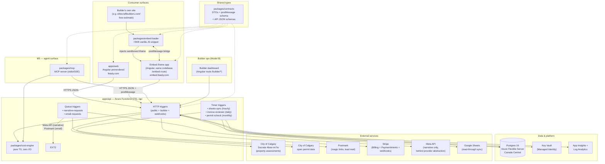

# Feasly — Technical Plan

**Status:** Draft for implementation (drives `plan/epics/` stories)
**Date:** 2026-09-23
**Supersedes nothing; implements:** `../adr/ADR-001-architecture.md` (approved 2026-09-22),
`BUILD_PLAN.md`, `SCHEMA.md`, `COST_ENGINE.md`, `UX_FLOW.md`
**Zero-external-action constraint:** no repos, Azure resources, domains, or accounts are
created by this plan — every step needing Karan is marked **NEEDS-KARAN** as a manual step.

---

## 0. Reading guide

- Section 1: what exists and how it connects (diagram).
- Sections 2–6: how each flow works, end to end, with concrete endpoints, tables,
  message types, and token lifetimes.
- Sections 7–13: environments, IaC, CI/CD, data, secrets, observability, security.
- Sections 14–15: every open decision and assumption, so nothing is decided silently.

Naming conventions used throughout:

| Prefix / pattern | Meaning |
|---|---|
| `ek_live_` / `ek_test_` | Embed tenant public key (loader `data-key`) |
| `fk_live_` / `fk_test_` | Agent API key (M5, `/api/v1`) |
| `feasly_rt` | One-time relay code query param (embed magic-link landing) |
| `/r/{token}` | Direct (feasly.com) magic-link report route |
| `app.feasly.com` | Reserved host for the embed iframe app (`embed.feasly.com`); final host naming NEEDS-KARAN with domain clearance (see §14.5) |

---

## 1. Component / service map

### 1.1 Logical architecture



### 1.2 Service inventory

| # | Component | Hosts / runs on | Owns |
|---|---|---|---|
| 1 | `apps/web` (Angular 18+, TS) | Azure Static Web Apps (Free) | Prerendered marketing/SEO pages, wizard, report, builder dashboard, admin (M4) |
| 2 | `packages/embed-loader` | CDN-ish static file on `embed.feasly.com/loader.js` (served by SWA) | Snippet: iframe injection, postMessage bridge, resize, token relay, fallback |
| 3 | `apps/api` (Azure Functions, Node 22, TS) | Functions **Flex Consumption** plan, Canada Central | All HTTP APIs, queue/timer triggers |
| 4 | `packages/cost-engine` | Imported by `apps/api` and `packages/mcp`; unit-tested | Deterministic estimate math (per COST_ENGINE.md) |
| 5 | `packages/contracts` | Build-time shared | DTO types, postMessage message schemas, `/api/v1` JSON schemas |
| 6 | `packages/mcp` (M5) | Standalone Node process (later: hosted SSE) | MCP tools wrapping engine + API |
| 7 | Postgres 16 | Azure Flexible Server, Canada Central | System of record (schema: SCHEMA.md + §2 deltas below) |
| 8 | Key Vault | Azure, Canada Central | All secrets; RBAC + Managed Identity |
| 9 | Postmark | SaaS | Transactional email (magic links, report shares, callbacks, dunning) |
| 10 | Stripe | SaaS | Subscriptions (flat plan), commission charging, webhooks |
| 11 | Meta API | SaaS (behind `packages/api-llm` provider abstraction in `apps/api`) | Narrative text only — never numbers |
| 12 | Socrata (City of Calgary) | `data.calgary.ca`, dataset `4bsw-nn7w` | Property assessments (cached in `properties`) |
| 13 | Sheets sync worker | Timer Function (hourly) | Postgres → Google Sheets (service account) |
| 14 | Permit cross-check job | Timer Function (monthly) | Calgary open permit data vs `commission_invoices`/`leads` |
| 15 | App Insights + Log Analytics | Azure, Canada Central | Logs, metrics, dashboards, alerts |

### 1.3 Monorepo layout (extends BUILD_PLAN.md M0)

```
feasly/
  apps/
    web/                  # Angular: routes /, /estimate/*, /r/:token, /embed, /builder/*, /admin/*
    api/                  # Azure Functions (TS)
      src/
        functions/        # one file per trigger: http-*.ts, timer-*.ts, queue-*.ts
        lib/              # db.ts, auth.ts, stripe.ts, postmark.ts, llm.ts, rateLimit.ts
  packages/
    cost-engine/          # pure TS, zero I/O (COST_ENGINE.md)
    contracts/            # shared DTOs, postMessage types, JSON schemas  (NEW)
    embed-loader/         # vanilla JS snippet, <5KB gzipped                     (NEW)
    mcp/                  # M5
  infra/bicep/            # §8
  db/migrations/          # dbmate SQL migrations  (§10)
  .github/workflows/      # §9
```

### 1.4 Schema deltas (extend SCHEMA.md — applied via migrations in §10)

SCHEMA.md stands; the flows below require these additions. All include
`city_id`/`tenant_id` where multi-tenant matters.

```sql
-- citext extension (users.email, leads.email already citext in SCHEMA.md)
CREATE EXTENSION IF NOT EXISTS citext;
CREATE EXTENSION IF NOT EXISTS pgcrypto;  -- gen_random_uuid()

-- tenants: embed/marketplace/billing columns
ALTER TABLE tenants ADD COLUMN tenant_type text NOT NULL DEFAULT 'feasly_direct'
  CHECK (tenant_type IN ('feasly_direct','embed','marketplace'));
ALTER TABLE tenants ADD COLUMN embed_domains text[] NOT NULL DEFAULT '{}';
ALTER TABLE tenants ADD COLUMN public_key text UNIQUE;              -- ek_live_... / ek_test_...
ALTER TABLE tenants ADD COLUMN brand_name text;
ALTER TABLE tenants ADD COLUMN logo_url text;
ALTER TABLE tenants ADD COLUMN accent_color text;                   -- validated ^#[0-9a-fA-F]{6}$
ALTER TABLE tenants ADD COLUMN estimate_path text;                  -- e.g. '/free-estimate'
ALTER TABLE tenants ADD COLUMN contact_phone text;                  -- degraded fallback CTA
ALTER TABLE tenants ADD COLUMN plan_type text CHECK (plan_type IN ('flat','commission'));
ALTER TABLE tenants ADD COLUMN stripe_customer_id text;
ALTER TABLE tenants ADD COLUMN agreement_version text;              -- contract terms version
ALTER TABLE tenants ADD COLUMN agreement_accepted_at timestamptz;
ALTER TABLE tenants ADD COLUMN embed_degraded boolean NOT NULL DEFAULT false;
ALTER TABLE tenants ADD COLUMN degraded_reason text;

-- Single-use embed relay codes (the fiddliest piece, §2.2). Separate table from
-- magic_links so semantics stay clean: relay codes are strictly single-use +
-- 10-minute expiry; magic_links are multi-use bearer tokens within their window.
CREATE TABLE embed_relay_codes (
  id          uuid PRIMARY KEY DEFAULT gen_random_uuid(),
  tenant_id   uuid NOT NULL REFERENCES tenants(id),
  user_id     uuid NOT NULL REFERENCES users(id),
  estimate_id uuid NOT NULL REFERENCES estimates(id),
  code_hash   text UNIQUE NOT NULL,          -- SHA-256 of the otc
  expires_at  timestamptz NOT NULL,          -- now() + 10 minutes
  used_at     timestamptz,
  created_at  timestamptz NOT NULL DEFAULT now()
);

-- Report shares (UX S10: email report to partner)
CREATE TABLE report_shares (
  id          uuid PRIMARY KEY DEFAULT gen_random_uuid(),
  estimate_id uuid NOT NULL REFERENCES estimates(id),
  user_id     uuid NOT NULL REFERENCES users(id),
  partner_email citext NOT NULL,
  magic_link_id uuid REFERENCES magic_links(id),  -- the link that was sent
  created_at  timestamptz NOT NULL DEFAULT now()
);

-- City waitlist (UX S1 non-Calgary path)
CREATE TABLE waitlist (
  id          uuid PRIMARY KEY DEFAULT gen_random_uuid(),
  email       citext NOT NULL,
  city_slug   text NOT NULL,
  created_at  timestamptz NOT NULL DEFAULT now(),
  UNIQUE (email, city_slug)
);

-- Commission invoices (Model B commission track)
CREATE TABLE commission_invoices (
  id                uuid PRIMARY KEY DEFAULT gen_random_uuid(),
  tenant_id         uuid NOT NULL REFERENCES tenants(id),
  lead_id           uuid NOT NULL REFERENCES leads(id),
  estimate_id       uuid NOT NULL REFERENCES estimates(id),
  contract_value_cents bigint NOT NULL CHECK (contract_value_cents > 0), -- excl. land
  commission_cents  bigint NOT NULL,            -- round(contract * 0.01)
  currency          text NOT NULL DEFAULT 'CAD',
  stripe_payment_intent_id text UNIQUE,     -- off-session PI at finalize; NO Stripe Invoices
  status            text NOT NULL DEFAULT 'draft'
                    CHECK (status IN ('draft','in_review','finalized','paid','failed','disputed','void')),
  review_due_at     timestamptz,                -- draft created + 7 days
  finalized_at      timestamptz,
  paid_at           timestamptz,
  created_at        timestamptz NOT NULL DEFAULT now()
);

-- Stripe webhook idempotency
CREATE TABLE stripe_events (
  event_id    text PRIMARY KEY,                 -- evt_...
  type        text NOT NULL,
  received_at timestamptz NOT NULL DEFAULT now()
);

-- Community aggregates for build-time prerender (§6)
CREATE TABLE community_stats (
  city_id       uuid NOT NULL REFERENCES cities(id),
  community     text NOT NULL,
  slug          text NOT NULL,                  -- url slug
  avg_assessed  bigint,
  median_assessed bigint,
  property_count int,
  computed_at   timestamptz NOT NULL DEFAULT now(),
  PRIMARY KEY (city_id, slug)
);
```

Lead-status note: `leads.status` is `('new','contacted','quoting','won','lost')`
(per SCHEMA.md — amended 2026-09-23). The builder "won" event maps directly to
`status='won'` + a `commission_invoices` row (status `'draft'` → `'in_review'`);
"lost" maps to `status='lost'`.

---

## 2. Request + data flows

### 2.1 Consumer estimate flow (feasly.com direct)

Covers UX S0 → S8. Tenant = NULL (`feasly_direct`).

```
S0/S1                S2/S3            S4              S5            S6/S7           S8
Landing/Address ---> Scope/Details -> Analyzing ---> Preview ---> Gate/Check ---> Report
  │                    │                │               │             │                │
  │ autocomplete       │ localStorage   │ POST          │ blurred     │ POST           │ GET
  │ POST /api/v1/      │ (wizard state) │ /api/v1/      │ payload:    │ /api/v1/        │ /api/v1/
  │ properties/      │                │ estimates     │ public      │ leads           │ r/{token}
  │ autocomplete     │                │ {inputs}      │ fields      │                 │
  │                    │                │               │ visible,    │                │
  │ GET /api/v1/       │                │ engine runs   │ build/total │ user+lead+     │ full figures
  │ property?          │                │ server-side;  │ replaced    │ magic_link     │ + narrative
  │ address_key=       │                │ immutable     │ by null +   │ rows; queue    │ (poll until
  │ (cached in         │                │ estimates row │ blur flags  │ narrative +    │ ready)
  │ `properties`)      │                │               │             │ email via      │
  │                    │                │               │             │ Postmark       │
```

Step-by-step with concrete contracts:

1. **Autocomplete** — `GET /api/v1/properties/autocomplete` `?q=1234 14`
   (3+ chars, debounced 250ms client-side). Server queries Socrata SoQL against
   `4bsw-nn7w` (`$q`, upper-cased, `street_name`/`address` fields), max 6 results,
   each guaranteed resolvable (returns `address_key`). Results cached 24h in
   `properties` by `address_key`. Rate limit: 60/min/IP (tier: public-anon).
2. **Property card** — `GET /api/v1/properties/resolve?address_key={key}` → public City fields
   only: `{ address_raw, community, lot_sqft, zoning, assessed_value,
   year_built }`. Cache-first on `properties`; on miss, fetch Socrata, upsert.
   Socrata failure → UX S1 error copy + Retry (never a dead end).
3. **Estimate** — `POST /api/v1/estimates`
   `{ project_type:'new_build', city:'calgary', sqft, tier, garage, basement,
   address_key, tenant_key? }`. Server: loads active `cost_data_versions` row for
   the city, runs `packages/cost-engine`, inserts immutable `estimates` row
   (inputs + outputs + version id), returns **blurred-safe DTO**:
   `{ estimate_id, public: {address…, assessed…, sqft, tier}, blurred: {build: true,
   total: true}, cost_data_version }`. No per-sqft, no margins, no params — the
   secret-leak unit test (§COST_ENGINE.md) runs against this serializer.
4. **Gate** — `POST /api/v1/estimates/{id}/gate`
   `{ email, name, phone?, timeline, casl_opt_in }`. Server (transaction):
   upsert `users` (citext email), insert `leads` (score from timeline:
   `0-3mo→hot`, `3-6mo→warm`, else `cold`; `consent_ts=now()`), generate magic
   token (32 random bytes, base64url; store **SHA-256 hash** in `magic_links`
   with `estimate_id`, `expires_at = now()+7d` — expiry NEEDS-KARAN §14.1),
   enqueue email-request (Postmark template `magic-link`), enqueue
   narrative-request. Returns `{ ok:true }` — never reveals whether the email
   was already known (enumeration resistance).
5. **Narrative worker** — queue trigger: loads estimate outputs + assumptions +
   City facts, calls Meta API via provider abstraction with the banned-list
   system prompt (COST_ENGINE.md), writes `estimates.narrative`. SLA target <60s;
   report page polls `GET /api/v1/r/{token}` with skeleton until `narrative`
   is non-null (figures render immediately — they don't wait for the LLM).
6. **Report** — user clicks email link `https://feasly.com/r/{token}`.
   `GET /api/v1/r/{token}`: hash the token, look up `magic_links` (+ join
   estimates/users), reject if expired/revoked with the UX S8 re-issue copy.
   Sets `used_at` on first open (analytics only — the bearer stays valid until
   `expires_at`). Returns full figures + narrative + assumptions + disclaimer.
   What-if re-runs (`POST /api/v1/r/{token}/whatif {tier?, sqft?}`) create **new**
   immutable `estimates` rows (corrections = new row per SCHEMA.md) and return
   fresh figures; the report header shows "Updated {date}".
7. **Share / callback / PDF** — `POST /api/v1/r/{token}/share {partner_email}`
   creates a fresh `magic_links` row + `report_shares` row and emails the partner
   (partner gets their own bearer — the consumer's link is never forwarded);
   `POST /api/v1/r/{token}/callback {phone, window}` emails the Feasly team via
   Postmark (no Calendly M1); PDF = print-optimized report stylesheet
   (`window.print()` → Save as PDF) in M1; server-side PDF (Gotenberg on
   Container Apps) is an M6 option, not M1 scope.

Rate limits (public-anon tier): autocomplete 60/min/IP · property 60/min/IP ·
estimates 20/hr/IP · gate 10/hr/IP · resend 5/hr per (email+IP) with 60s
per-email cooldown · report 120/hr/IP (bearer-gated anyway).

### 2.2 Embed flow + cross-iframe auth token relay (Model B)

This is the fiddliest piece; the handshake is specified exactly.

**Actors:** homeowner (browser), builder page (parent window, builder's origin),
loader snippet (JS running in parent), iframe app (`https://embed.feasly.com`,
Angular `/embed` route, sandboxed **without** `allow-same-origin`), Functions API.

**Setup (one time, builder dashboard):** builder sets `estimate_path`
(e.g. `/free-estimate`), `embed_domains` (e.g. `elitecraftbuilders.com`),
branding, plan, card-on-file. Dashboard shows the snippet:

```html
<div data-feasly></div>
<script async src="https://embed.feasly.com/loader.js"
        data-key="ek_live_4f8a…"></script>
<noscript><a href="https://feasly.com/estimate">Get your free build estimate</a></noscript>
```

**Runtime sequence — anonymous estimate inside the iframe** is identical to §2.1
except every request carries `tenant_key` (from loader `data-key`), the
`estimates`/`leads` rows get `tenant_id`, and branding comes from
`GET /api/v1/embed/config?key=ek_live_…` (public: brand name, logo, accent,
`badgeRequired:true`, `degraded:false`, estimate path).

**Runtime sequence — magic-link return (the relay):**

```
  Email link (embed tenant):                                    Builder page
  https://{builderDomain}{estimatePath}?feasly_rt={OTC}  ──►  loader.js on DOMContentLoaded
                                                                │ 1. parse feasly_rt
                                                                │ 2. history.replaceState (strip param)
                                                                │ 3. inject iframe (if not present)
     ┌──────────────────────────────────────────────────────────┘
     ▼
  postMessage handshake (all messages namespaced FEASLY_, §4.3):
     iframe ──FEASLY_READY {loaderVersion}──────────────► parent   (4)
     parent ──FEASLY_RELAY_TOKEN {code: OTC}───────────► iframe   (5)  [targetOrigin: https://embed.feasly.com]
     iframe validates event.origin === 'https://embed.feasly.com'      (6)
     iframe ──POST /api/v1/embed/session {code, tenant_key}            (7)
     server: hash code → embed_relay_codes:
              exists? not used? not expired (10 min)? tenant matches tenant_key?
              → mark used_at (single-use enforced in one UPDATE … WHERE used_at IS NULL)
              → mint session JWT (12h, claims {sub:user_id, est:estimate_id, ten:tenant_id})
              → return { session, report: <full report DTO> }
     iframe stores JWT **in memory only** (Angular service; no localStorage — opaque
              origin has none; no cookies — third-party cookies are blocked)
     iframe ──FEASLY_AUTH_OK {estimateId}───────────────► parent   (8)  (for builder analytics; NO PII)
     iframe routes to embedded report view (figures + narrative + what-if)
```

**Token lifetimes (relay):**

| Token | Lifetime | Uses | Storage |
|---|---|---|---|
| `feasly_rt` OTC | 10 minutes | **single** (atomic `UPDATE … WHERE used_at IS NULL`) | SHA-256 hash in `embed_relay_codes` |
| Session JWT | 12 hours | many (in-memory) | **never persisted**; `Authorization: Bearer` header |
| Direct magic link (`/r/{token}`) | 7 days (proposed, NEEDS-KARAN) | many within window | SHA-256 hash in `magic_links` |

**Fallbacks (the relay must never strand the user):**

- **Link opened where the snippet isn't installed** (forwarded, wrong page): the
  email also contains a secondary plain link `https://feasly.com/r/{token}`
  ("or view it here"). That bearer works standalone with tenant branding applied
  from the estimate's `tenant_id`.
- **OTC expired/used/invalid:** iframe shows "This link has expired — enter your
  email for a fresh one" → `POST /api/v1/magic-links/resend` issues a new OTC +
  bearer (old rows revoked).
- **No `feasly_rt` param:** loader behaves normally — iframe boots to the
  wizard/landing state. `FEASLY_RELAY_TOKEN` is simply never sent.

**Why the parent page can't steal the session:** the JWT goes only to the
iframe (targetOrigin-locked postMessage carries just the OTC, which is useless
after first redemption); the session JWT never crosses the postMessage bridge
— `FEASLY_AUTH_OK` carries only `{estimateId, leadScore}` for the builder's
analytics. A malicious parent page could phish the OTC from its own URL, but
it is that page's own URL — equivalent power to the magic link itself, which
the threat model already accepts as a bearer (UX_FLOW cross-cutting #6).

**Why no third-party cookies:** Chrome/Safari/Firefox block third-party cookies
by default; the iframe is third-party on builder domains. Cookie sessions
would silently fail for most homeowners. The design therefore uses **zero
cookies and zero storage in the iframe**: memory-held JWT + `Authorization`
header. Consequence (documented, accepted): closing the tab ends the iframe
session; the magic link re-establishes it in one click.

### 2.3 Builder ops flow (Model B SaaS)

```
Signup → Plan choice → Agreement → Card-on-file → Snippet install → Pipeline → Won/Lost → Invoice
```

1. **Signup** — `POST /api/v1/builder/signup {name, email, company, city}` →
   creates `tenants` row (`tenant_type='embed'`, inactive), `users` row for the
   builder contact, issues builder magic link (same `magic_links` table,
   `estimate_id=NULL`) → builder dashboard session (first-party feasly.com, so a
   normal httpOnly session cookie is fine here — see §3.4).
2. **Plan choice** — dashboard: Flat `$X/mo` unlimited (price NEEDS-KARAN §14.7)
   **or** 1% commission. Writes `tenants.plan_type`.
3. **Agreement** — builder accepts platform agreement (version pinned in
   `tenants.agreement_version`, `agreement_accepted_at`); 1% terms, 12-mo
   attribution window, 14-day reporting SLA, prior-relationship exclusion —
   contract text itself is legal's artifact (M6), the version pin is ours.
4. **Card-on-file (mandatory on both plans)** — Stripe SetupIntent
   (`POST /api/v1/builder/payment-method/setup-intent`) → Stripe Elements on
   dashboard → `payment_method.attached` webhook → `tenants.stripe_customer_id`
   set. Snippet + `public_key` (`ek_live_…`) are **not issued until a payment
   method is on file** — this is the collection gate.
5. **Snippet install** — dashboard shows the loader snippet + `data-key`,
   install checklist, test-estimate button, `estimate_path` + `embed_domains`
   configuration.
6. **Pipeline dashboard** — `GET /api/v1/builder/leads` (tenant-scoped,
   cursor-paginated; filters: score, status, date). Lead cards show name,
   contact, timeline, score, estimate summary link (builder-view report URL with
   a short-lived builder bearer — never the consumer's magic link), status
   transitions `PATCH /api/v1/builder/leads/{id} {status, notes}`.
7. **Won / lost** — builder marks won: `POST /api/v1/builder/leads/{id}/won
   {contract_value_cents}` (excl. land; validated >0) → `leads.status='won'`,
   `commission_invoices` row (`status='draft'`, `commission_cents =
   round(value*0.01)`) → internal invoice to `status='in_review'`,
   `review_due_at = now()+7d`. Lost → `status='lost'`, no invoice. The 14-day
   reporting SLA is enforced by the invoice-reviewer timer cross-checking
   `leads` updated recently to `won` without an invoice. Billing mechanism
   decided 2026-09-23 (USER_VALIDATION.md P0-D): **internal
   `commission_invoices` + Stripe off-session PaymentIntents — no Stripe
   Invoices** (the 7-day review/dispute window and dispute-pause semantics
   stay under Feasly's control).
8. **Attribution (Model A later)** — same tables; `tenants.tenant_type=
   'marketplace'`, leads carry `source='web'` and the match metadata in
   `leads.notes`/a future `lead_matches` table (M-marketplace milestone, not M1).

**Elite Craft pilot note:** Elite is `tenant_type='embed'`, sits **out** of the
marketplace pool initially (a `marketplace_eligible` flag defaults false;
Elite's row stays false until the 10-builder rule in the product context is met).

### 2.4 Billing flow (Stripe)

**Products / prices (Stripe dashboard + IaC-seeded via script — NEEDS-KARAN values):**

| Product | Billing |
|---|---|
| Feasly Embed — Flat (`price_flat_monthly`, $X/mo — NEEDS-KARAN §14.7) | Recurring Stripe subscription |
| Feasly Commission | Internal `commission_invoices` rows; 1% of signed contract value, excl. land; charged via Stripe off-session PaymentIntent (no Stripe Invoices) |

**Card-on-file mandate:** `SetupIntent` with `usage='off_session'` at signup;
webhook `payment_method.attached` → tenant activated. Both plans require it —
commission-plan builders are charged off-session later.

**Commission invoice lifecycle (internal records + Stripe PaymentIntents):**

```
won reported ──► draft ──► in_review (7-day window) ──► finalized ──► paid
                      │            │ review_due_at passes        │ off-session
                      │            │ (invoice-reviewer timer      │ PaymentIntent
                      │            │  creates PI against card)     │ against saved
                      │            └─► builder disputes ──► disputed ──► void (manual, logged)
                      └─► payment_failed ──► dunning (§5.4)
```

Receipts in M1 = Postmark-hosted HTML receipts (server-side PDF deferred to
M6). Dispute freezes the charge clock at `disputed` (ATT-006) until a human
resolves it to `void` or back to `in_review`.
```

- Draft invoice created as an internal `commission_invoices` row,
  status `in_review`, `review_due_at = now()+7d`.
- Daily `invoice-reviewer` timer: for rows past `review_due_at` with no dispute
  flag → create off-session `PaymentIntent` against the saved payment method →
  `payment_intent.succeeded` → `paid`; `payment_intent.payment_failed` →
  `failed` → dunning state machine (§5.4).
- Disputes during review: builder clicks "dispute" → status `disputed`,
  charge clock frozen, ops notified; resolution = `void` or back to
  `in_review` (human, logged).
  manual step, fully logged.

**Webhooks** — `POST /api/v1/webhooks/stripe`: verify signature with
`STRIPE_WEBHOOK_SECRET` (raw body — Functions must read the raw buffer before
JSON parsing), insert `event_id` into `stripe_events` first (idempotency; unique
violation = already handled → 200), then dispatch:
`payment_intent.succeeded|payment_failed` (commission charges),
`invoice.payment_succeeded|payment_failed` (flat-plan **subscriptions** —
Stripe Billing's own invoices, not our commission mechanism),
`customer.subscription.updated|deleted`, `payment_method.attached|detached`.
Unhandled types → logged, 200 (never 500-retry loops on unknown types).

**Proration:** plan switches take effect immediately; Stripe
`proration_behavior='create_prorations'` on subscription updates. Flat→
commission: cancel subscription at period end; commission→flat: new subscription
starts immediately.

### 2.5 SEO publishing flow (build-time)

```
main merge ──► build job:
  1. node scripts/fetch-prerender-data.ts
       → reads community_stats (Postgres) + Socrata aggregates
       → writes dist-data/community-pages.json
  2. ng build + prerender (routes from routes.txt, §6.1)
       → per-route HTML with titles/meta/OG/JSON-LD
  3. node scripts/emit-seo-files.ts
       → sitemap.xml, robots.txt, llms.txt
  4. Lighthouse CI (budgets, §6.4)
  5. SWA deploy
```

`community_stats` is refreshed by a weekly timer (`community-stats-refresh`)
so programmatic pages track the City dataset without a redeploy of logic —
content updates ride the normal build (or a scheduled rebuild; §6.2).

### 2.6 Auxiliary flows

- **Sheets sync (hourly timer):** rows from `leads` (+ joined users/estimates
  summaries) where `sheets_synced_at IS NULL` or updated since → append/update
  via Sheets API (service account); set watermark. Postgres stays source of
  truth; failures → retry with backoff, alert after 3 consecutive failures.
- **Permit cross-check (monthly timer):** query Calgary open building-permit
  dataset for permits issued in the last 30 days; fuzzy-match applicant/site
  address against `leads` with `status='won'` and recent `commission_invoices`;
  mismatches (permit exists, no won-report within SLA) → ops report. **Open:**
  whether the permit dataset exposes an applicant-name field (§14.6) — the
  matcher is address-first until verified.
- **Narrative generation (queue):** as §2.1 step 5. Provider abstraction
  (`lib/llm.ts`: `generateNarrative(input): Promise<Narrative>`) so Meta API
  can be swapped; prompts versioned in `apps/api/src/prompts/v1.ts`; every
  generation logs `prompt_version` + `cost_data_version` for audit.
- **M5 agent API:** `POST /api/v1/get_property|estimate_project|submit_lead`
  with `Authorization: Bearer fk_live_…` (hash-checked against `api_keys`,
  scopes + per-key `rate_limit` enforced, every call metered into `api_usage`).
  Same engine, same lead pipeline (`source='api'`/`'mcp'`).

---

## 3. Auth design

### 3.1 Magic-link V1 (consumers)

- **Token:** 32 bytes from `crypto.randomBytes`, base64url-encoded (~43 chars,
  256-bit entropy). The token itself is **never stored** — only its SHA-256 hex
  digest in `magic_links.token_hash` (UNIQUE).
- **Semantics:** multi-use bearer within the expiry window (7 days proposed,
  NEEDS-KARAN). `used_at` records first redemption (analytics); the link keeps
  working until `expires_at`. Rationale: report re-opens, partner shares, and
  "Updated {date}" re-runs all assume a durable link; strict single-use would
  break S8/S10. The **embed relay codes** (§2.2) are the strictly single-use
  instrument where replay would be dangerous.
- **Resend:** `POST /api/v1/magic-links/resend {email}` — 60s per-email cooldown,
  5/hr per (email+IP); **always returns 200** with the same copy whether or not
  the email exists (enumeration resistance); issuing a new link revokes prior
  unexpired links for the same `(user_id, estimate_id)`.
- **Validation:** constant-time hash compare; expired/revoked → generic
  "link invalid or expired" + re-issue UI (no oracle distinguishing
  nonexistent vs expired).
- **Forwarded links:** accepted as bearer by design (UX_FLOW #6); disclosed on
  the privacy page. Partner shares (S10) mint a **separate** bearer so the
  consumer's link is never the one forwarded.

### 3.2 Embed relay codes

Per §2.2: 24-byte base64url OTC, SHA-256 stored, 10-minute expiry, atomic
single-use (`UPDATE embed_relay_codes SET used_at=now() WHERE id=$1 AND
used_at IS NULL` — zero rows updated = replay → reject), bound to
`(tenant_id, user_id, estimate_id)`. Redemption requires the matching
`tenant_key` in the request body.

### 3.3 Session JWT (iframe)

HS256, signing key in Key Vault (`jwt-signing-key`), claims
`{sub, est, ten, iat, exp}` with `exp = iat + 12h`. Held **in memory only** in
the iframe app; sent as `Authorization: Bearer`. Functions validate signature +
`ten` matches the request's tenant context. Key rotation: keep `N`/`N-1` keys
(`jwt-signing-key` + `jwt-signing-key-prev`), 24h overlap (§11).

### 3.4 Builder dashboard sessions

First-party context (feasly.com), so a normal `httpOnly; Secure; SameSite=Lax`
session cookie is used after builder magic-link redemption. 24h sliding expiry,
stored as a hashed session id in a `builder_sessions` table (add in the same
migration as §1.4). Admin (M4) reuses this mechanism with a role claim.

### 3.5 Why no passwords — and no cross-site cookie sessions

Passwords add breach surface, reset flows, and support load for zero benefit in
a low-frequency product (a homeowner may visit twice ever). Cross-site cookie
sessions are **technically unavailable** in the embed (third-party cookie
blocking) — the relay + in-memory JWT exists precisely because cookies can't.
One auth primitive (email ownership proof) covers consumers, builders, and
admins.

---

## 4. Embed architecture

### 4.1 Loader snippet (`packages/embed-loader`)

- **Size budget:** <5KB gzipped, zero dependencies, `async` + `defer`-safe.
- **Boot:** on `DOMContentLoaded` (or immediately if already loaded): find
  `[data-feasly]` container (create one at the script tag's position if absent),
  read `data-key` (`ek_live_…`), strip `feasly_rt` from the URL via
  `history.replaceState`, fetch `GET /api/v1/embed/config?key=` (cached in
  memory; 5-min TTL), then inject the iframe.
- **Iframe element:**
  ```html
  <iframe src="https://embed.feasly.com/embed?key=ek_live_…"
          sandbox="allow-scripts allow-forms allow-popups"
          allow="clipboard-write"
          title="Build cost estimator"
          style="width:100%;border:0" scrolling="no"></iframe>
  ```
- **Sandbox flags — justification:**
  | Flag | Why |
  |---|---|
  | `allow-scripts` | Required: the Angular app is JS. |
  | `allow-forms` | Required: wizard inputs, gate form, callback form. |
  | `allow-popups` | Required: PDF "Save as PDF" opens a print tab; `mailto:` fallback. |
  | ~~`allow-same-origin`~~ **excluded** | **Critical.** Keeps the iframe origin opaque: the embed app cannot reach the parent DOM, cannot read/write parent storage, and cannot remove its own sandbox. Side effect we design *for*: no localStorage/cookies → forces the memory-JWT design (§2.2), which is exactly what makes the embed third-party-cookie-proof. |
  | ~~`allow-top-navigation`~~ **excluded** | The iframe can never navigate the builder's page (anti-phishing/clickjacking). All navigation stays inside the iframe. |
  | ~~`allow-modals`~~ **excluded** | No `alert()`/print-dialog hijinks from inside. |
- **Auto-resize:** iframe runs a `ResizeObserver` → `FEASLY_RESIZE {height}` →
  loader clamps to 420–4000px and sets `iframe.style.height`. No polling.
- **Degraded / no-JS behavior:**
  - `<noscript>` → static link to `feasly.com/estimate` (always in the snippet).
  - Loader fetch fails (adblock, network) → container renders fallback card:
    "Get your free build estimate →" linking to feasly.com (tenant tagged via
    `?t={slug}` so attribution survives).
  - `config.degraded=true` (dunning, §5.4) → loader renders the **fallback
    contact card** instead of the iframe: "{brandName} — call {contact_phone}"
    (lead-gen paused, page never breaks).
  - `config.active=false` (tenant offboarded) → same fallback card.

### 4.2 Theme handshake

1. Loader → iframe (with `FEASLY_READY` ack): `FEASLY_INIT {tenantKey,
   theme: {brandName, logoUrl, accentColor}, loaderVersion}` — theme comes from
   the already-fetched public config so first paint is branded (no flash).
2. Iframe applies CSS custom properties (`--feasly-accent` etc.), renders the
   **"Powered by Feasly" badge** (bottom-right of the embed chrome, always
   visible, links to feasly.com). `badgeRequired:true` is contractual; the full
   white-label tier (badge removal) is a NEEDS-KARAN pricing decision (§14.8).
3. Iframe → parent: `FEASLY_THEME_APPLIED {}` (loader hides its skeleton).

### 4.3 postMessage contract (`packages/contracts/postmessage.ts`)

Every message: `{ ns:'FEASLY', v:1, type, payload }`. Unknown `type` → ignored
+ logged. Schemas are JSON-Schema published and contract-tested in CI (§9).

| Direction | Type | Payload | Purpose |
|---|---|---|---|
| P→I | `FEASLY_INIT` | `{tenantKey, theme, loaderVersion}` | Boot + theme |
| I→P | `FEASLY_READY` | `{loaderVersionSeen, embedVersion}` | Iframe booted |
| P→I | `FEASLY_RELAY_TOKEN` | `{code}` | Magic-link OTC handoff (§2.2) |
| I→P | `FEASLY_AUTH_OK` | `{estimateId, leadScore}` | Session established (NO PII, NO JWT) |
| I→P | `FEASLY_AUTH_ERROR` | `{code: 'expired'|'invalid'|'used'}` | Relay failed → re-issue UI |
| I→P | `FEASLY_RESIZE` | `{height}` | Auto-resize |
| I→P | `FEASLY_LEAD_EVENT` | `{event:'gate_submitted', estimateId, leadScore}` | Builder CRM/analytics hook (no PII) |
| I→P | `FEASLY_THEME_APPLIED` | `{}` | First branded paint done |

**Origin validation (both directions, no exceptions):**

- Iframe accepts messages **only** if `event.origin` is in the tenant's
  `embed_domains` allowlist (fetched with config; exact-match, https only,
  no wildcards in M1).
- Loader sends `FEASLY_RELAY_TOKEN` **only** with
  `targetOrigin='https://embed.feasly.com'` (never `'*'`).
- Loader accepts `FEASLY_*` **only** from `event.origin ===
  'https://embed.feasly.com'` **and** `event.source === iframe.contentWindow`.
- `FEASLY_RELAY_TOKEN` is accepted by the iframe **once per boot**; extras ignored.

### 4.4 Third-party-cookie independence — rationale recap

The iframe is third-party on builder domains; Chrome/Firefox/Safari block
third-party cookies, and the sandbox (no `allow-same-origin`) denies storage
anyway. Therefore: no cookie auth, no localStorage, no fingerprinting in the
embed. Session = in-memory JWT (§3.3), bootstrap = URL-param OTC (§2.2),
persistence across tab-close = the magic link itself (re-click re-establishes).
This is a deliberate simplification, not a limitation to patch later.

---

## 5. Billing architecture

### 5.1 Stripe objects

- **Customer** per tenant (`tenants.stripe_customer_id`), created at signup.
- **Product "Feasly Embed — Flat"** → recurring Price `price_flat_monthly`
  (`$X`/mo CAD, NEEDS-KARAN §14.7). Subscription with
  `collection_method='charge_automatically'`, `off_session` mandate from the
  SetupIntent.
- **Commission:** no standing price. Each won deal → internal
  `commission_invoices` row (`commission_cents = round(contract_value_cents *
  0.01)`, description includes estimate id + "excl. land"). At finalize
  (post-review), an off-session `PaymentIntent` charges the saved card.
- **Idempotency keys** on every Stripe write: `feasly:{table}:{row_id}:{action}`
  (e.g. PaymentIntent creation) so timer retries never double-charge.

### 5.2 Webhook handling

`POST /api/v1/webhooks/stripe` (raw-body signature verification, §2.4).
Event → `stripe_events` insert (idempotency) → handler:

| Event | Effect |
|---|---|
| `payment_method.attached` | Tenant billing-ready → issue `public_key`, unblock snippet |
| `payment_intent.succeeded` | `commission_invoices.status='paid'`; clear dunning flags |
| `payment_intent.payment_failed` | `status='failed'` → dunning machine |
| `customer.subscription.updated` | Sync `status` (active/past_due/canceled) to tenant record |
| `customer.subscription.deleted` | Tenant → `embed_degraded=true`, reason `subscription_canceled` |
| `payment_method.detached` | If no remaining methods → tenant billing-blocked (no new invoices; dashboard banner) |

### 5.3 Draft → review → auto-charge (commission)

Per §2.4: 7-day `in_review` window (`review_due_at`), builder sees the draft in
the dashboard with line-item detail and a dispute button. The daily
`invoice-reviewer` timer creates an off-session `PaymentIntent` for undisputed
invoices (idempotency key `feasly:commission_invoices:{id}:charge`) →
`payment_intent.succeeded` → `paid`; failure → dunning (§5.4). Dispute →
status `disputed` (charge clock frozen), ops notified, resolution logged
(`void`, or back to `in_review` → charge proceeds).

### 5.4 Dunning state machine → embed degradation mapping

| State | Trigger | Effect on embed | Comms |
|---|---|---|---|
| `current` | — | Full iframe | — |
| `past_due` | payment failed | Full iframe (grace) | Postmark: day 0, 3, 6 |
| `degraded` | still unpaid at day 8 (days 0–7 grace) | `tenants.embed_degraded=true` → loader renders **contact-fallback card** (lead-gen paused, page intact) | Dashboard banner + email |
| `suspended` | unpaid at day 22 | Same as degraded + tenant disabled in API | Final notice |
| recovered | `payment_intent.succeeded` | Flags cleared within 5 min (webhook) → iframe restored | Receipt |

Smart Retries stay on in Stripe; our machine is the source of truth for the
embed behavior. Every transition is logged to App Insights with
`tenantId` + `stripeInvoiceId`.

### 5.5 Proration and plan switches

Immediate effect; `proration_behavior='create_prorations'`. Flat→commission:
subscription `cancel_at_period_end=true` (embed stays live until period end).
Commission→flat: subscription starts now; any `in_review` commission invoices
still run their course (they're for already-won deals).

---

## 6. Prerendering / SEO pipeline

### 6.1 Route classification

| Prerender at build | Never prerender (client-rendered) |
|---|---|
| `/`, `/how-it-works`, `/pricing`, `/sample-report`, `/communities`, `/communities/{slug}` (programmatic, from `community_stats`), `/privacy`, `/terms`, `/faq` | `/estimate/*` (wizard), `/r/{token}` (report — private bearer), `/embed` (iframe app), `/builder/*`, `/admin/*` |

Programmatic community pages: slugs from `community_stats` (one row per
community, refreshed weekly by timer). Each page: aggregate assessed-value
context, "what it costs to build in {community}" ranges computed **at build
time from the same cost engine** (build script imports `packages/cost-engine`
with the active `cost_data_version` — ranges only, no params leak), FAQ
schema, canonical URL.

### 6.2 Build-time data flow

`apps/web/scripts/fetch-prerender-data.ts` (Node, runs in CI before `ng build`):
reads `community_stats` via a read-only DB role + Socrata fallback → writes
`src/app/seo/community-pages.json` → Angular prerender consumes it →
`emit-seo-files.ts` writes `sitemap.xml` (all prerendered routes, weekly
`changefreq` for community pages), `robots.txt` (allow `/`, disallow
`/estimate/`, `/r/`, `/builder/`, `/admin/`, `/embed`), `llms.txt` (site summary
+ canonical API/estimate entry points for AI agents — the agent-friendly
distribution surface).

### 6.3 Schema.org injection points

- `LocalBusiness` (+ `areaServed`) JSON-LD on `/communities/{slug}`.
- `FAQPage` on `/how-it-works` and `/faq`.
- `Product`/`Service` with `aggregateRating` only when real reviews exist
  (never fabricated — banned until then).
- Per-page `<title>`, meta description, OG/Twitter tags via Angular route data;
  OG images generated at build (static template + community name overlay).

### 6.4 Core Web Vitals budget (Lighthouse CI)

`lighthouserc.json` enforced on every PR touching `apps/web`:

| Metric | Budget |
|---|---|
| LCP | ≤ 2.5s |
| CLS | ≤ 0.05 |
| TBT | ≤ 200ms |
| Performance score | ≥ 90 (mobile, Moto G4 profile) |
| JS bundle (initial, gzip) | ≤ 170KB |

Build fails on regression. The blur-heavy preview (S5) uses CSS `filter: blur`
on a placeholder layer (GPU-cheap), not duplicated DOM.

---

## 7. Environments

| | Local | Dev | Staging | Prod |
|---|---|---|---|---|
| SWA | `swa start` (local) | `feasly-dev` (Free) | `feasly-stg` (Free) | `feasly-prod` (Free→Standard if SLA needed) |
| Functions | `func start` + **Azurite** | Flex Consumption | Flex Consumption | Flex Consumption |
| Postgres | Docker `postgres:16` | B1ms burstable | B2s burstable | B2s burstable (§10) |
| Postmark | sandbox token | test stream | test stream | live stream |
| Stripe | **Stripe CLI** (`listen --forward-to`) | test mode | test mode | **live** (NEEDS-KARAN: account) |
| Meta API | mocked provider | dev key / mock | dev key | live key (Key Vault) |
| Seed data | `db/seed/dev.sql` | fixture tenants | anonymized prod-like | — |
| URL | `localhost:4200` | `dev.feasly.com` | `stg.feasly.com` | `feasly.com` (NEEDS-KARAN §14.5) |

- **`.env` scaffolding:** `.env.example` checked in; `.env` gitignored;
  `scripts/pull-dev-secrets.sh` hydrates from Key Vault (dev) — never commit real values.
- **PR preview environments:** every PR gets a SWA preview URL (frontend) wired to the
  **dev** API + dev Postgres (clearly flagged test data). No migrations run on previews;
  Stripe in test mode. Preview tears down on PR close.
- **Promotion:** local → dev (push to feature branch, manual deploy) → staging (merge to
  `main`, auto) → prod (manual approval in the GitHub `production` environment, §9).
  Staging mirrors prod SKUs so perf surprises show up before prod.

---

## 8. IaC layout (Bicep)

`infra/bicep/`:

```
infra/bicep/
  main.bicep                  # subscription or RG-scope entry; wires modules
  main.dev.bicepparam
  main.staging.bicepparam
  main.prod.bicepparam
  modules/
    postgres.bicep            # Flexible Server + firewall + PgBouncer param
    functionapp.bicep         # Flex Consumption plan + app + settings (KV refs)
    swa.bicep                 # Static Web App (Free) + custom domain hook
    keyvault.bicep            # RBAC, purge protection (prod=true)
    appinsights.bicep         # App Insights + Log Analytics workspace
    dns.bicep                 # DNS zone + A/CNAME + SWA managed TLS
```

### 8.1 Module notes

- **Postgres** (`postgres.bicep`): `Microsoft.DBforPostgreSQL/flexibleServers`,
  PG 16. SKU per env: dev `Standard_B1ms`, staging/prod `Standard_B2s`
  (burstable; §10 rationale). Storage 32GB (autoscale to 128GB prod),
  `backupRetentionDays: 30` (PITR), `geoRedundantBackup: Disabled` (MVP cost;
  revisit with revenue), `highAvailability: Disabled` (documented; zone-redundant
  HA is the first paid reliability upgrade). Firewall: deny public by default;
  allow Azure services + CI runner IPs at deploy time only. Server parameter
  `pgbouncer.enabled = true` (transaction pooling for Functions).
- **Function App** (`functionapp.bicep`): **Flex Consumption (FC1)** plan —
  chosen over classic Consumption (Y1) for better cold starts (~1–3s vs 2–10s)
  and VNet-integration headroom without Premium pricing. **Cold-start note:**
  the first request after idle still pauses; the wizard's S4 "Analyzing" beat
  (UX_FLOW) is the designed UX cover, and the timer triggers keep one instance
  warm-ish. If report-open p95 latency hurts conversion, the lever is
  `alwaysReady: 1` instance on Flex (~$15/mo) — a measured decision, not M1 scope.
- **SWA** (`swa.bicep`): SKU `Free`; custom domain + free managed TLS.
  Staging environments enabled for PR previews (§9).
- **Key Vault** (`keyvault.bicep`): RBAC authorization; Function App
  system-assigned Managed Identity gets **Key Vault Secrets User**; purge
  protection on prod; soft-delete 90 days everywhere.
- **App Insights** (`appinsights.bicep`): workspace-based; sampling 10% prod,
  100% dev.
- **DNS/TLS** (`dns.bicep`): zone for the domain (NEEDS-KARAN §14.5);
  SWA custom-domain binding validates via CNAME; TLS is SWA-managed (no cert
  handling in Bicep).

### 8.2 Parameter files

One `.bicepparam` per env: `envName`, `location` (`canadacentral` — fixed for
all envs; PIPEDA residency), SKUs, backup retention, alert email, Postmark
stream ids (non-secret), Stripe price ids (non-secret; the *secret* keys live
in Key Vault). No secrets in parameter files, ever.

### 8.3 Deployment-state / what-if strategy

- `main.bicep` targets a **resource group per env**
  (`rg-feasly-dev|staging|prod`); subscription-level deployment creates the RGs.
- CI on PRs touching `infra/**`: `az deployment group what-if` posts the diff
  as a PR comment (destructive changes flagged `⚠ delete`).
- CD: staging applies automatically on `main` merge; **prod applies only via
  the `production` GitHub Environment with manual approval** (same gate as §9).
- State is Azure-side (no Terraform state files); drift check = monthly
  `what-if` run on a schedule, alerting on unexpected diffs.

---

## 9. CI/CD design

### 9.1 Pipeline stages (`.github/workflows/ci.yml` on every PR)

```
lint → typecheck → unit → contract → build → infra-whatif → lighthouse
```

| Stage | Tool | Scope |
|---|---|---|
| lint | `eslint` (flat config, repo-wide) | all packages |
| typecheck | `tsc --noEmit` | `apps/*`, `packages/*` |
| unit | `vitest` | `cost-engine` (formula pins, property tests, **secret-leak test**), `api` lib, `embed-loader` |
| contract | `vitest` + JSON Schema | `packages/contracts`: API DTO schemas, postMessage schemas; Pact-style consumer test: loader↔iframe message sequence |
| build | `ng build` + prerender dry-run | `apps/web` (catches prerender data errors early) |
| infra-whatif | `az deployment group what-if` | only when `infra/**` changed |
| lighthouse | `lhci` vs `lighthouserc.json` | only when `apps/web/**` changed (§6.4 budgets) |

PRs also get a **SWA preview environment** (frontend) wired to the **dev API +
dev DB** (flagged test data; migrations never run on previews; Stripe test mode).

### 9.2 Promotion flow

```
PR ──► ci.yml ──► merge to main ──► cd-staging.yml (auto) ──► approval ──► cd-prod.yml
                                        │                          │
                                   migrate staging            migrate prod (backup first)
                                   deploy SWA+Functions        deploy SWA+Functions
                                   smoke tests                 smoke tests + synthetic estimate
```

- `cd-staging.yml`: auto on `main` push — runs `dbmate migrate` against staging,
  deploys SWA + Functions, runs smoke tests (health, sample estimate, magic-link
  round-trip on a test address).
- `cd-prod.yml`: **manual approval** in the GitHub `production` environment
  (Karan or delegate). Pre-migration: automated DB snapshot note + verify latest
  automated backup <24h old. Then `dbmate migrate`, deploy, smoke tests
  (including a synthetic end-to-end estimate → gate → report on a fixture
  address, cleaned up after).
- **Migration gating:** the deploy job fails closed if migrations fail; the app
  never deploys against an un-migrated schema (migration step precedes app
  deploy; app code is backward-compatible with the previous schema for one
  release — the expand/contract discipline for breaking changes).

### 9.3 Rollback story

- **App rollback:** redeploy the previous SWA deployment + previous Functions
  package (both are immutable artifacts in the workflow run; one-click
  re-run of `cd-prod.yml` with the prior SHA).
- **DB rollback:** migrations are **forward-only** — there is no `down`.
  A bad migration is fixed by a **new fix-forward migration**, reviewed and
  shipped through the same pipeline. `dbmate` runs each migration in a
  transaction: a failed migration leaves the schema untouched and pages
  (§12). PITR restore is the break-glass option (RPO ≤ 5 min on Flexible
  Server with 30-day retention) — a runbook in `infra/runbooks/`.

---

## 10. Postgres ops

### 10.1 Provisioning notes (Flexible Server, Canada Central)

- PG 16, `Standard_B2s` prod / `Standard_B1ms` dev (burstable tier rationale:
  MVP traffic is spiky and low; burstable credits absorb estimate bursts at
  ~1/4 the cost of General Purpose; upgrade path to `D2ds_v4` is a SKU change
  when sustained CPU >60%).
- 32GB storage, autogrow to 128GB; 30-day backup retention (PITR);
  zone-redundant HA **off** for MVP (documented risk; first paid upgrade).
- `pgbouncer.enabled=true`, pool mode **transaction**; Functions use `node-pg`
  `Pool` with `max: 4` per instance — serverless instances × small pools ×
  PgBouncer = safe under burst.
- Extensions: `pgcrypto`, `citext` (§1.4). No PostGIS in M1 (lot polygons are
  stored as GeoJSON in `jsonb`; spatial queries deferred to the comparison
  milestone if needed).

### 10.2 Migration framework — comparison and recommendation

| | **dbmate** | node-pg-migrate | Prisma Migrate |
|---|---|---|---|
| Migration format | Plain SQL files | JS/TS builders | Prisma schema → SQL |
| Lock-in | None — just SQL | Node API | Whole Prisma ORM |
| `down` migrations | Optional (we won't use) | Supported | N/A (forward-only-ish) |
| CI story | Single binary, `DATABASE_URL` | npm + config file | `prisma migrate deploy` |
| Fit for SCHEMA.md | **Exact** — SCHEMA.md is already SQL | Good | Would require translating SQL → Prisma schema |
| Team fit | Karan can read every migration as SQL | Fine | New DSL to learn |

**Recommendation: dbmate.** Reasoning: the schema is specified as SQL
(SCHEMA.md), the team is small, migrations must be reviewable by Karan as
plain SQL, and dbmate adds no ORM opinions — the app uses `node-pg` directly.
The cost-engine stays pure; the DB layer stays boring.

### 10.3 Migration process

- Location: `db/migrations/`, naming `YYYYMMDDHHMMSS_description.sql`
  (dbmate `new`), **forward-only**, one transaction each.
- Rules: additive changes preferred; destructive changes (drop column) require
  expand→migrate→contract across two releases; every migration has a
  corresponding story acceptance check ("staging migrated clean").
- CI: PRs with migrations run them against a throwaway Docker Postgres
  (catches syntax errors before merge).
- CD: `main` → auto-migrate **staging**; prod migration runs inside
  `cd-prod.yml` **after** manual approval and backup verification.
- Failure: transaction rolls back automatically → pipeline fails → alert fires
  → fix-forward migration. Never hand-edit prod schema.

### 10.4 Backup / PITR

Automated backups, 30-day retention, PITR to any point in window (RPO ~minutes).
Pre-prod-migration: verify latest backup timestamp in the workflow. Monthly
restore drill to a throwaway server (story in hardening epic; untested backups
are not backups).

---

## 11. Secrets management

- **Key Vault + Managed Identity everywhere.** Function App settings reference
  secrets as `@Microsoft.KeyVault(SecretUri=https://kv-feasly-prod.vault.azure.net/secrets/stripe-secret-key/)`.
  The app never sees a secret value at rest in config; SWA frontend holds **no
  secrets at all** (public keys like `ek_live_…` and Stripe *publishable* key
  are public by design).
- **Secret inventory** (names in Key Vault; values never in repo):

| Secret | Used by | Rotation |
|---|---|---|
| `postgres-app-password` | Functions → PG | 90d, dual-password via PG roles |
| `stripe-secret-key` / `stripe-webhook-secret` | Billing | Webhook secret rotatable in Stripe dashboard; dual-secret support in verifier |
| `postmark-server-token` | Email queue worker | On suspected leak |
| `meta-api-key` | Narrative worker | On suspected leak |
| `jwt-signing-key` (+ `-prev`) | Session JWT | 90d, 24h overlap window |
| `google-sheets-service-account` | Sheets sync | 180d |
| `socrata-app-token` (optional; raises rate limits) | Property lookups | Yearly |

- **Rotation runbook** (`infra/runbooks/secret-rotation.md`): dual-secret
  pattern — write new version, deploy code reading new+old, flip, retire old.
  JWT rotation keeps `-prev` valid for 24h so in-flight iframe sessions survive.
- **Local dev:** `.env` (gitignored, from `.env.example`) + helper script
  `scripts/pull-dev-secrets.sh` (`az keyvault secret show` → `.env`; requires
  Azure login, never committed). CI uses GitHub Environment secrets only for
  *deploy credentials* (OIDC preferred — no stored Azure credentials at all).

---

## 12. Observability

- **App Insights** (workspace-based) for all Functions; SWA frontend sends
  custom events via the App Insights JS SDK (consent-aware — no tracking
  before the privacy notice is acknowledged, per UX_FLOW analytics rule).
- **Structured logging convention** (JSON to stdout): every log line carries
  `{ ts, level, traceId, tenantId?, userId?, event, durationMs?, … }`.
  `traceId` = W3C `traceparent` propagated from the frontend (`x-request-id`
  generated per wizard session) through Functions, queue messages, and the
  Meta API call — one estimate's whole journey is greppable.
- **Dashboards** (Azure Workbook, one per audience):

| Dashboard | Key metrics |
|---|---|
| Funnel / conversion | landing→address→scope→preview→gate→report-open rates; gate conversion by tenant; what-if usage |
| Engine health | estimate p50/p95 latency; engine error rate; Socrata cache hit %; Socrata error rate |
| Lead pipeline | leads by score/status/tenant; median time new→contacted; Sheets sync lag |
| Billing health | MRR (flat), in-review commission aging, past-due count, dunning transitions, webhook failure rate |
| Email | Postmark send/bounce/complaint rates; magic-link open rate; resend rate |

- **Alerting thresholds** (Azure Monitor → email + webhook):

| Signal | Threshold |
|---|---|
| HTTP 5xx rate | >1% over 5 min |
| Function failures | >5 in 10 min (any timer/queue trigger) |
| Estimate p95 latency | >8s over 15 min |
| Postmark bounce rate | >5% over 1h |
| Stripe webhook failures | any 3 consecutive |
| DB CPU / storage | >75% 15 min / >80% |
| Rate-limit hits spike | >100/min (possible abuse) |
| Cert / domain expiry | 21 days out |

---

## 13. Security / trust boundaries

### 13.1 Public vs server-only — the hard line

| Public (may reach the browser) | Server-only (never leaves Functions/PG) |
|---|---|
| Estimate **ranges** (land/build/total low–high) | `per_sqft` params, margin tables, `build_tiers`/`land`/`reno` JSON |
| Engine `assumptions[]` strings | `cost_data_versions` rows (whole table) |
| City-assessed values, community names, zoning labels | Socrata app token, Meta API key |
| Tenant brand name/logo/accent, `ek_live_…` key | Stripe secret key, webhook secret |
| Magic-link **token** (in the user's email only) | `token_hash`, `code_hash`, JWT signing key |
| Narrative text | Prompts are code, not secret — but prompt *versions* are audit-logged |

Enforcement: the API serializes through DTO types in `packages/contracts`
(**not** the DB row types); the cost-engine **secret-leak test** asserts
serialized estimate payloads contain no `per_sqft|margin|param` keys; CI fails
on violation.

### 13.2 CORS policy

- `api.feasly.com` (Functions): `https://feasly.com`, `https://*.feasly.com`
  only. **No wildcard.** Tenant embed domains are **not** added to CORS —
  the iframe calls the API as first-party (`embed.feasly.com` → `api.feasly.com`
  is covered by `*.feasly.com`).
- `GET /api/v1/embed/config` additionally allows no CORS widening (it's fetched
  by the loader from the builder's origin — fetch mode `cors` with the
  tenant's exact `embed_domains` echoed as `Access-Control-Allow-Origin` after
  allowlist check; credentials never included).

### 13.3 Rate limiting tiers

| Tier | Scope | Limits (per window) |
|---|---|---|
| public-anon | IP | autocomplete 60/min · property 60/min · estimates 20/hr · gate 10/hr |
| email-gated | email+IP | resend: 60s cooldown, 5/hr |
| embed | tenant key | config 120/min · session exchange 30/min |
| builder | session | pipeline reads 300/min · mutations 60/min |
| agent (M5) | API key | per-key `rate_limit`/min (default 100), hard cap 1000/min |

Implementation: in-memory token bucket per Function instance + a Postgres
`rate_limit_hits` counter for abuse alerting (Redis deferred until needed —
documented simplification). Burst traffic from one builder's viral page is
absorbed by Flex Consumption scale-out, not by raising limits silently.

### 13.4 PII, PIPEDA, CASL

- **Minimization:** we collect email + name (+phone only if callback requested).
  Wizard inputs pre-gate hold no PII and stay in `localStorage`.
- **Residency:** all Azure resources in **Canada Central**; Postgres backups
  stay in-region. **Flag:** Postmark processes email in the US — disclosed in
  the privacy page; legal review (M6) confirms wording.
- **CASL:** marketing checkbox unchecked by default (UX S6); `consent_ts`
  recorded on every lead; transactional magic-link emails are not marketing.
  Unsubscribe link + one-click opt-out on any market-update email (M4+).
- **Access/erasure:** `GET /api/v1/privacy/export` and `DELETE
  /api/v1/privacy/erase` (magic-link authenticated) — PIPEDA individual-access
  right; stories in the hardening epic.

### 13.5 Hardening specifics

- **postMessage:** §4.3 origin validation; `targetOrigin` never `'*'` for
  `FEASLY_RELAY_TOKEN`; iframe accepts `FEASLY_RELAY_TOKEN` once per boot.
- **Stripe webhooks:** raw-body signature verification; `stripe_events`
  idempotency; unknown event types → 200 + log (no retry storms).
- **Magic links:** 256-bit tokens, hash-only storage, constant-time compare,
  generic error copy, resend throttling (§3.1).
- **Inputs:** SoQL query built from an allowlist of fields (no string
  interpolation of user input into Socrata queries); `address_key`
  normalization (lowercase, trimmed, unit-stripped) prevents cache poisoning;
  `accent_color` validated against `^#[0-9a-fA-F]{6}$`; `estimate_path` must
  start with `/`.
- **Dependencies:** `npm audit` in CI (fail on high+), Dependabot weekly,
  Functions runtime pinned (Node 22 LTS).

---

## 14. Open decision points carried forward

| # | Decision | Source | Recommendation | Status |
|---|---|---|---|---|
| 1 | Magic-link expiry window (7 days proposed) | ADR Q3, UX Q3 | 7 days — matches "report as durable artifact" use | **NEEDS-KARAN** |
| 2 | Renovation card in M1: disabled+“Coming soon” vs selectable→waitlist | UX Q1 | Disabled + badge (no second lead path yet) | **NEEDS-KARAN** |
| 3 | Name field at gate: required or optional | UX Q2 | Required ("What should we call you?") — callback needs it | **NEEDS-KARAN** |
| 4 | Sample report on landing | UX Q4 | Yes — fictional address, clearly labeled "Sample" | **NEEDS-KARAN** |
| 5 | Domain clearance: feasly.com availability/price; fallback .ca or rename | ADR Q4 | Check registrar; `.ca` fallback keeps Canadian trust | **NEEDS-KARAN** (manual check) |
| 6 | Permit dataset: does Calgary open permit data expose applicant name? | Product context | Research task: inspect dataset schema; matcher is address-first until verified | Open — research, not Karan's call |
| 7 | Flat-fee price point $X/mo | Product context | — (needs cost + positioning math; story produces options) | **NEEDS-KARAN** |
| 8 | Full white-label tier (badge removal, custom domain) | Product context | Paid tier only; badge stays on standard embed | **NEEDS-KARAN** |
| 9 | Public accuracy-claim wording | Alignment 2026-09-22 | **Drop the ±X% figure from public copy entirely** — "range-based estimates from our cost model"; the ±15% target is an internal calibration metric (M6), never a promise | **NEEDS-KARAN** |
| 10 | Lead dedupe: same email + address within 90 days → update vs new | SCHEMA notes | Update existing lead, new estimate snapshot linked | **NEEDS-KARAN** |
| 11 | Postmark US data transit — privacy-page disclosure wording | §13.4 | Lawyer review before launch (M6) | Open — legal |
| 12 | Flex Consumption (FC1) vs classic Consumption for Functions | §8.1 | Flex — better cold starts, same serverless cost profile | Assumed (revisit on bill) |
| 13 | Single Postgres primary, no replica/HA for MVP | §10.1 | Accepted risk; HA is first paid reliability upgrade | Assumed |
| 14 | English-only M1 (no i18n scaffolding) | — | Yes — i18n when second city/language justifies it | Assumed |
| 15 | Builder configures `estimate_path` + `embed_domains` in dashboard | §2.2 | Yes — validated at save (path starts with `/`, domains https) | Assumed |

---

## 15. Assumptions log + open questions for Karan

### 15.1 Assumptions (chosen where sources were ambiguous; simplest option wins)

1. **A1 — Magic-link semantics:** multi-use bearer within expiry; `used_at` is
   analytics, not invalidation. (Strict single-use reserved for embed relay codes.)
2. **A2 — Report PDF:** M1 = print-optimized stylesheet + `window.print()`;
   server-side PDF deferred to M6. "Branded PDF" is satisfied via Save-as-PDF.
3. **A3 — Narrative timing:** generated async post-gate via queue; figures never
   wait for the LLM; skeleton UI covers the <60s gap.
4. **A4 — `leads.status`:** builder "won" = `won` + `commission_invoices` row
   (enum new|contacted|quoting|won|lost per SCHEMA.md); builder "lost" = `lost`.
   no new status value (per SCHEMA.md check constraint).
5. **A5 — Preview environments:** SWA preview (frontend) → dev API/DB; no
   migrations on previews; Stripe test mode.
6. **A6 — Rate limiting:** in-memory token buckets per instance; Redis deferred.
7. **A7 — Community pages:** built from `community_stats` (weekly refresh);
   ranges computed at build time with the pinned `cost_data_version`.
8. **A8 — Builder dashboard auth:** first-party httpOnly session cookie after
   builder magic-link (cookies are fine on feasly.com — only the cross-site
   iframe is cookie-free).
9. **A9 — Elite Craft:** `tenant_type='embed'`, `marketplace_eligible=false`
   until the marketplace milestone's 10-builder rule is met.
10. **A10 — Region:** Canada Central for everything (PIPEDA residency posture).
11. **A11 — `properties` cache:** 30-day TTL on `properties.fetched_at`
    (assessments update annually — decided 2026-09-23, supersedes the older
    24h wording); stale-while-revalidate on read past TTL (serve cached
    flagged `stale:true`, refresh in background) so City API hiccups never
    block the wizard. The property card always shows "data as of {date}"
    (WEB-004).
12. **A12 — MCP hosting (M5):** stdio-first for local assistants; hosted SSE
    endpoint deferred until a consumer needs it.

### 15.2 Open questions for Karan

1. **Q1 — §14.1:** Confirm 7-day magic-link expiry (or pick another window).
2. **Q2 — §14.2/14.3/14.4:** Renovation card behavior, name-required-at-gate,
   sample report on landing — confirm the three recommendations.
3. **Q3 — §14.5:** feasly.com — check availability/price; approve fallback plan.
4. **Q4 — §14.7:** Flat embed price $X/mo — need your call (story will bring
   cost/positioning options first).
5. **Q5 — §14.8:** Full white-label tier — offer it, and at what price?
6. **Q6 — §14.9:** Confirm dropping the public ±% accuracy claim.
7. **Q7 — §14.10:** Lead dedupe rule — update-in-place within 90 days OK?
8. **Q8 — Azure/GitHub:** existing subscription + GitHub org, or create fresh?
   (Blocks M0 — still the critical path.)
9. **Q9 — Cost Sheet:** share the 3–4 houses of historical cost data to
   calibrate `2026-XX-v1` (blocks engine freeze → M1).
10. **Q10 — Stripe account:** create (or grant access) when billing stories start;
    nothing billable happens before your explicit go-ahead per item.

## 16. Canonical API route registry (frozen — api-mcp/08)

> **This table is generated from `apps/api/src/registry/route-registry.ts`.**
> Do not edit it by hand — add the route to the registry first, then
> regenerate. CI (`test/route-registry.conformance.test.ts`) fails if this
> table drifts from the registry, if any deployed Function binding names a
> route not in the registry, or if any `/api/v1/…` literal in the codebase
> does not resolve to a registry entry.
>
> `status: live` = Function binding exists on main. `status: planned` = a
> story references it; implementation must use exactly this method + path.

| Method | Path | Auth | Rate limit | Status | Summary |
|---|---|---|---|---|---|
| GET | `/api/health` | none | 100/min per IP | live | Liveness + dependency checks (2s DB timeout). |
| POST | `/api/v1/estimate` | none | 20/hr per IP · 20/hr per tenant (embed) | live | Run a cost estimate (deterministic engine). Public for the web funnel; agent/MCP callers send an API key. |
| POST | `/api/v1/leads` | none | 10/min per IP (dedicated lead limiter) | live | Submit a lead (email required, phone optional). Sends the magic-link email. 90-day dedupe window returns the existing lead. |
| GET | `/api/v1/magic-link/verify` | magic-token | 100/min per IP | live | Verify a magic-link token (?token=). Resolves to the newest estimate for the email + property. Token IS the credential. |
| POST | `/api/v1/magic-link/reissue` | none | 60s cooldown · 5/hr per email+IP | live | Idempotent "resend my link". Unknown emails get the same response (no enumeration oracle). |
| GET | `/api/v1/reports/{reportToken}` | magic-token | 100/min per IP | planned | Resolve a report snapshot by token (immutable shared snapshot; see report redesign). Token IS the credential. |
| GET | `/api/v1/properties/autocomplete` | none | 60/min per IP | live | Calgary address autocomplete (City of Calgary assessment roll). Free by design. |
| GET | `/api/v1/properties/lookup` | none | 60/min per IP | live | Property record lookup (assessed value, lot, zoning). Deterministic multi-parcel selection. OUT_OF_COVERAGE for non-Calgary. |
| POST | `/api/v1/events` | none | 300/min per IP (dedicated analytics limiter) | live | First-party analytics ingest (consent-gated funnel events). Payloads require a valid consent_ts. |
| GET | `/api/v1/privacy/export` | magic-token | 100/min per IP | live | PIPEDA data export for the token holder. |
| POST | `/api/v1/privacy/erase-requests` | magic-token | 10/min per IP | live | Request erasure; returns a requestId for confirmation. |
| POST | `/api/v1/privacy/erase-requests/{requestId}/confirm` | magic-token | 10/min per IP | live | Confirm an erasure request (second factor via email link). |
| GET | `/api/v1/unsubscribe/{token}` | magic-token | 100/min per IP | live | Unsubscribe landing state (token IS the credential). |
| POST | `/api/v1/unsubscribe/{token}` | magic-token | 10/min per IP | live | Record the opt-out (CASL). |
| GET | `/api/v1/communities/{slug}/stats` | none | 100/min per IP | live | Prerendered community page statistics (SEO content engine). |
| GET | `/api/v1/embed/config` | none | 120/min per tenant key | live | Public embed config (?key=tenant). Logo, accent colour, contact fallback. Unknown keys → 404 UNKNOWN_TENANT. |
| POST | `/api/v1/embed/session` | none | 30/min per tenant key | planned | Exchange a single-use embed relay code for a 12h session token (embed/06). Replays/expired → 410. |
| POST | `/api/v1/chat/ask` | none | 20/hr per IP | planned | Grounded chat assistant (consumer/05). Session-scoped, rate-limited, allowlisted. Deterministic engine owns all dollar figures. |
| GET | `/api/v1/openapi.json` | none | 100/min per IP (1h cache) | live | Generated OpenAPI 3.1 spec (api-mcp/03). No auth by design. |
| POST | `/api/v1/admin/auth/request` | none | 5/hr per email+IP | planned | Request an admin magic link. Identical response for allowlisted and non-allowlisted emails (no enumeration oracle). |
| GET | `/api/v1/admin/auth/verify/{token}` | magic-token | 10/min per IP | planned | Consume the admin magic link → httpOnly Secure SameSite=Lax session cookie, 7-day expiry. Single-use (replay-safe). |
| GET | `/api/v1/admin/api-keys` | admin | 100/min per session | live | List API keys (masked, paginated). |
| POST | `/api/v1/admin/api-keys` | admin | 10/min per session | live | Issue an API key. Plaintext returned once; only the SHA-256 hash is stored. Scopes + per-key rate limit. |
| POST | `/api/v1/admin/api-keys/{id}/rotate` | admin | 10/min per session | live | Rotate a key (old key stays valid for a grace window). |
| POST | `/api/v1/admin/api-keys/{id}/revoke` | admin | 10/min per session | live | Revoke a key immediately. Audit-logged. |
| GET | `/api/v1/admin/leads` | admin | 300/min per session | planned | Leads explorer (admin/02): filters, free-text search, cursor pagination. |
| GET | `/api/v1/admin/leads/{id}` | admin | 300/min per session | planned | Lead detail: estimate summary, timeline, consent, attribution. |
| POST | `/api/v1/admin/leads/{id}/notes` | admin | 60/min per session | planned | Append-only lead notes. |
| PATCH | `/api/v1/admin/leads/{id}/status` | admin | 60/min per session | planned | Lead status (new/contacted/quoting/won/lost). Writes lead_status_history; audit-logged. |
| GET | `/api/v1/admin/leads/export.csv` | admin | 10/min per session | planned | CSV export of the filtered lead set. |
| GET | `/api/v1/admin/estimates/{id}` | admin | 300/min per session | planned | Estimate lookup for support/debugging. |
| GET | `/api/v1/admin/funnels` | admin | 300/min per session | planned | Funnel dashboards (admin/07): step drop-off, gate conversion. |
| GET | `/api/v1/admin/usage` | admin | 300/min per session | planned | Per-key usage metering (api-mcp/07). |
| GET | `/api/v1/admin/calibration` | admin | 300/min per session | planned | Calibration console reads (admin/09). |
| GET | `/api/v1/admin/ops/sheets-status` | admin | 300/min per session | planned | Sheets sync worker status (admin/05). |
| POST | `/api/v1/admin/ops/sheets-sync-now` | admin | 10/min per session | planned | Trigger an immediate Sheets sync (admin/04). |
| POST | `/api/v1/builder/agreement/accept` | none | 10/min per IP | planned | Accept the platform agreement (clickwrap, embed/10). Lawyer text pending — placeholder records acceptance. |
| GET | `/api/v1/builder/leads` | builder-session | 300/min per session | planned | Builder pipeline dashboard: attributed leads (embed/09). |
| GET | `/api/v1/builder/leads/{id}` | builder-session | 300/min per session | planned | Attributed lead detail (tenant-scoped). |
| POST | `/api/v1/stripe/webhooks` | stripe-signature | 100/min per IP | live | Stripe webhook receiver (billing track). Signature-verified; idempotent event handling. |

---

*End of TECH_PLAN.md — implements ADR-001; drives stories in `plan/epics/`.*
